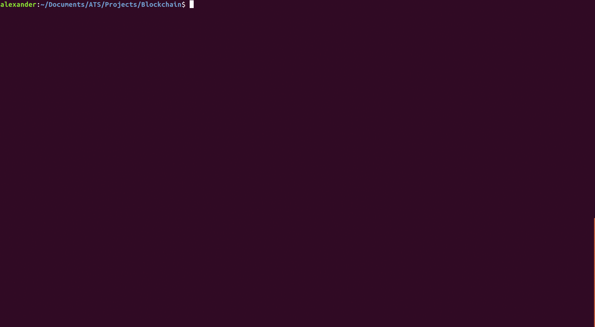

# Report

[](https://travis-ci.org/galletti94/ATS-blockchain)
[](https://opensource.org/licenses/BSD-3-Clause)

Blockchain, Smart Contract, and Database implementation in ATS



## About

The CLI is currently to be used in the following way:

1. define miners/users
2. make transactions (valid or otherwise)
3. write/execute smart contract
4. write/execute queries
5. decide who will mine the next block
6. view the balance of users
7. view the blockchain and/or repeat from 1/2

The full report is online. Part 1 is [here](https://beta.observablehq.com/@galletti94/functional-blockchain) and part 2 is [here](https://beta.observablehq.com/@galletti94/functional-blockchain-part-2).

## Running the application

After installing [ATS](http://www.ats-lang.org/), simply run

```shell
git clone https://github.com/ashalkhakov/colorado.git  
make regress
```
