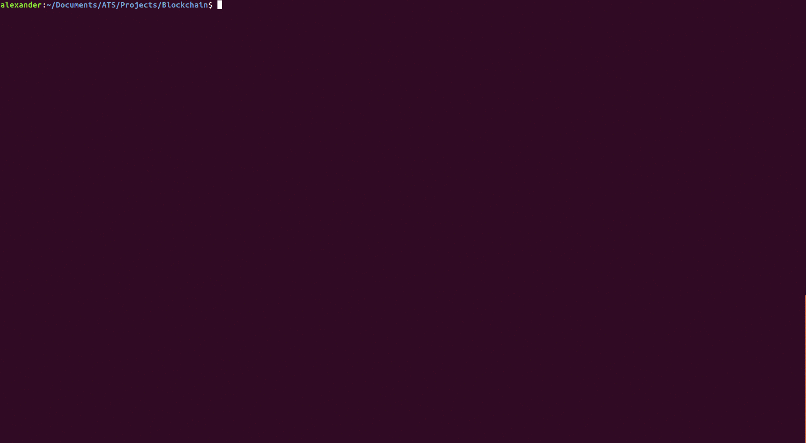

# ATS Blockchain

A blockchain CLI in ATS



## About

Although this is currently just a toy blockchain, a number of fundamental functionalities - a refinement of which is underway - are currently supported. These include:

- mining a block
- appending a block to the blockchain
- creating a transaction
- creating a smart contract

## The CLI

### Running the application

If you wish to run a smart contract, please read below on how to create a smart contract. Otherwise, after installing [ATS](http://www.ats-lang.org/), simply run

```shell
make regress
```

Please follow the instructions in the CLI.

### Smart Contracts

I implemented a lisp-like language for this blockchain to create what are called smart contracts. At a high level, these smart contracts are just code running on the blockchain so to speak. I provide the user with two ways of writing smart contracts. The first is by utilizing ATS, the other is by writing code directly in the lisp-like language. Both are currently very similar but building upon the lambda language in the ATS framework is possible before generating lambda code.

#### ATS -> lambda

Please take a look at the [prime.dats](./lambda/prime.dats) file along with the [helper_interp.dats](./lambda/helper_interp.dats) files for an example of writing code in ATS to generate lambda code.

#### lambda

The language is based on lambda calculus. It is discouraged to write directly in this language but if you do, the code should be put in a .txt file - the relative path of which should be given to the "code" command of the CLI.

## TODO

- [ ] improve parser
- [ ] jsonify blockchain.txt
- [ ] refine using dependent types
- [ ] coinbase
- [ ] validate transactions
- [ ] make blockchain distributed
- [ ] enhance lambda lang to include transactions
- [ ] enhance lambda lang to be not lisp-like
- [ ] enhance lambda lang to be typed

